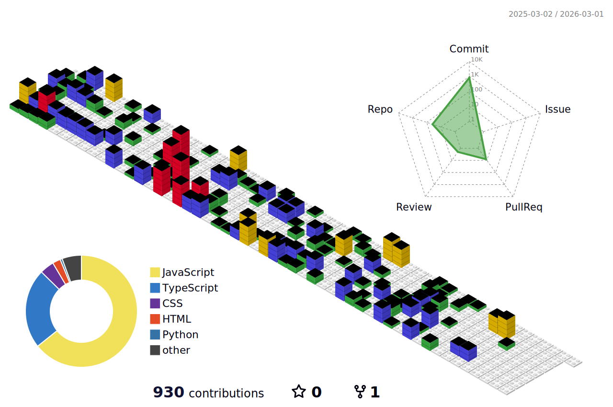

# Hi, I'm Nori :)

I’m a **Frontend Developer** and aspiring **UI/UX Designer** with a passion for crafting beautiful, user-friendly interfaces. I love combining design and code to create seamless digital experiences.

I value strong communication and teamwork, which help me build better solutions and foster a positive work environment. I’m naturally curious and always eager to understand how things work — and how to make them better. Whether I’m refining a layout, improving accessibility, or diving into a new framework, I stay committed to growing every day.

🚀 I’m currently looking for my first frontend developer role — excited to join a team where I can learn, build, and contribute. Open to international opportunities.

## 🛠 My Tech Toolbox  
- **Languages:** HTML, CSS, JavaScript, TypeScript
- **Frameworks/Libraries:** React, Tailwind CSS 
- **Currently Learning:** Three.js

## 💡 Let's Connect!  
I’m always open to collaborations, tech conversations, and new opportunities. Feel free to reach out:  

- 🌐 [Website](https://sophienora.codes)  
- ✍️ [Blog](https://noracodes.hashnode.dev)  
- 💼 [LinkedIn](https://www.linkedin.com/feed/)  
- 🎨 [CodePen](https://codepen.io/zofienora)

---

