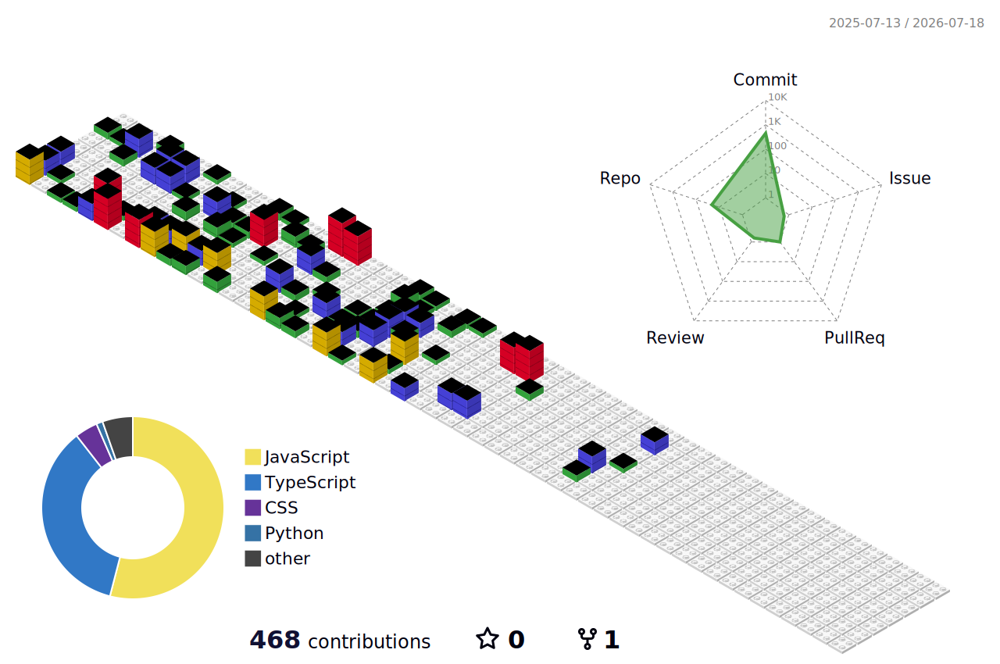

## 🎓 Currently Learning
- Harvard’s **CS50’s Introduction to Python**
- MicroMasters in **Software Development** at the University of British Columbia

## 🤝 Let’s Connect
Always open to collaborations, mentorship, and tech conversations.

- 🌐 [sophienora.codes](https://sophienora.codes)  
- 💼 [LinkedIn](https://www.linkedin.com/in/sophie-nora-keil)  
- 🧪 [CodePen](https://codepen.io/zofienora)  
- 💌 [sophienora92@gmail.com](mailto:sophienora92@gmail.com)

---

