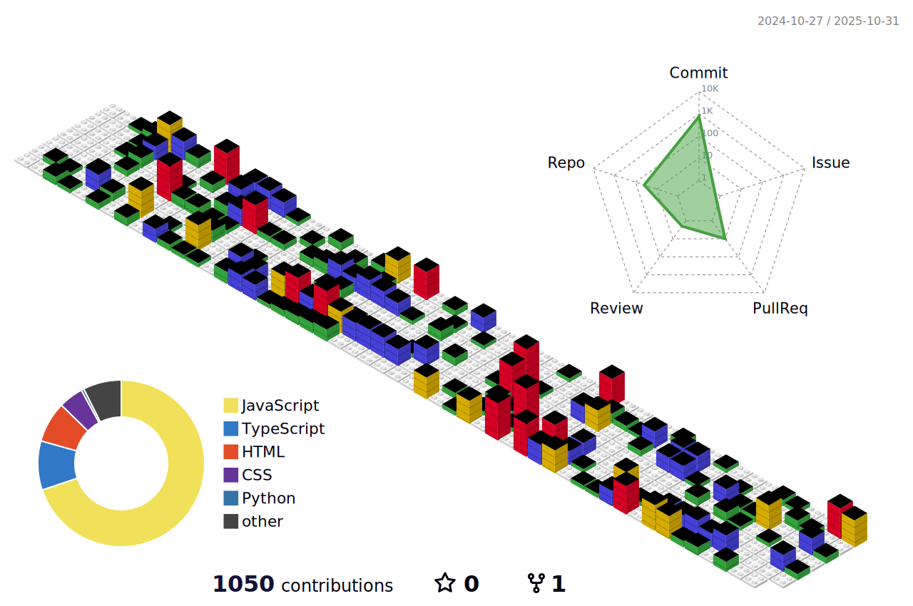

# Hi, I'm Nori :)

I’m a Frontend Developer and aspiring UI/UX Designer with a passion for crafting beautiful, user-friendly interfaces. I love blending design and code to create seamless digital experiences. Inspired by brutalist architecture, design, and long city walks, I bring my curiosity for small details into the way I build and create.

I’m currently looking for my first frontend developer role — excited to join a team where I can learn, build, and contribute. Open to international opportunities.

## My Tech Toolbox  
- **Languages:** HTML, CSS, JavaScript, TypeScript
- **Frameworks/Libraries:** React, Tailwind CSS 
- **Currently Learning:** Three.js

## Let's Connect!  
I’m always open to collaborations, tech conversations, and new opportunities. Feel free to reach out:  

- [Website](https://sophienora.codes)  
- [LinkedIn](https://www.linkedin.com/feed/)  
- [CodePen](https://codepen.io/zofienora)

---

